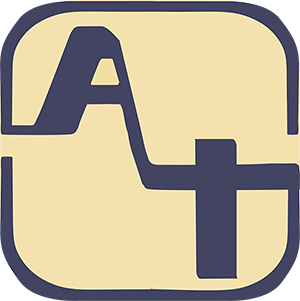

# AidTracker
>帮助志愿者组织或个人进行一体化物资对接与追踪的项目管理平台

发起成员在2020年1月至3月活跃在一些应对COVID-19危机的物资捐赠志愿者组织中。临时捐赠活动中出现的许多问题让我们发现了对捐赠对接项目管理云平台的需求。许多捐赠方 (特别缺乏经验的临时组织)在医院需求对接，货源核查，物资追踪，医院接受确认等流程中因信息收集渠道零散、对接不规范，浪费了许多人力物力。
于是我们便尝试建立这样一个平台来帮助志愿者和需要物资的机构。将对捐赠流程进行标准化、信息化的提升，让每位捐赠者，每个需要物资的医疗机构能快速、准确、轻松地上手捐赠对接流程是我们发起这个项目的初衷。

主要服务对象：
缺乏高效自主捐赠项目管理平台的捐赠者
缺乏高效自主捐赠项目管理平台的受赠者

产品的设计可以概括为三个功能模块X两类用户进行操作。每个分项的大致功能如下：
|          | 需求页                | 我的项目                                       |个人中心                      |
|----------|----------------------|-----------------------------------------------|-----------------------------|
| 捐赠方操作 | 查看所有需求<br/>发起捐赠项目 |查看项目是否获批<br/>上传发货与物流信息<br/>查看收货与认证    |更改用户信息<br/>身份验证<br/>更多捐赠帮助|   
| 受赠方操作 | 发布个人需求<br/>管理个人需求 |批准／不批准捐赠项目<br/>查看发货与物流信息<br/>上传收货与认证 |更改用户信息<br/>身份验证<br/>更多捐赠帮助|


## Getting started ／／to be edited

A quick introduction of the minimal setup you need to get a hello world up &
running.

```shell
commands here
```
Here you should say what actually happens when you execute the code above.

## Developing

### Built With
基于taro框架搭建的小程序应用
基础表包括：
／／List main libraries, frameworks used including versions (React, Angular etc...)


# Aid Tracker

> 请严格要求与对待

## 开始

- 安装 Taro 2.0.7

```
	npm install -g @tarojs/cli@2.0.7
```

- 安装项目配置,并执行

```
	npm install
	npm run dev:weapp
```

- 执行 mock

```
	npm run mock
```

- 打开小程序开发者工具即可看到

## 代码提交规范：

- git add / git commit（commit 规范见下面）
- git pull --rebase
- git push

